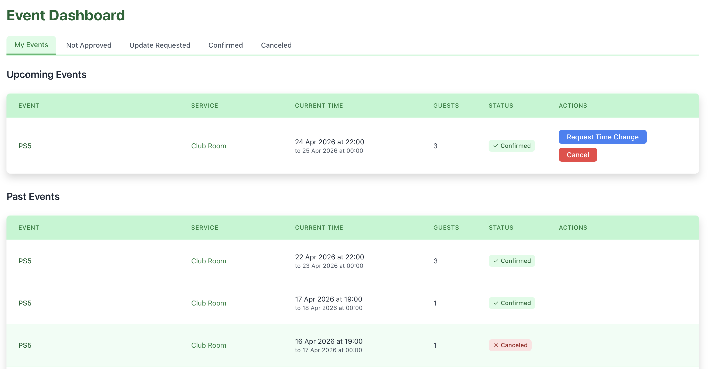
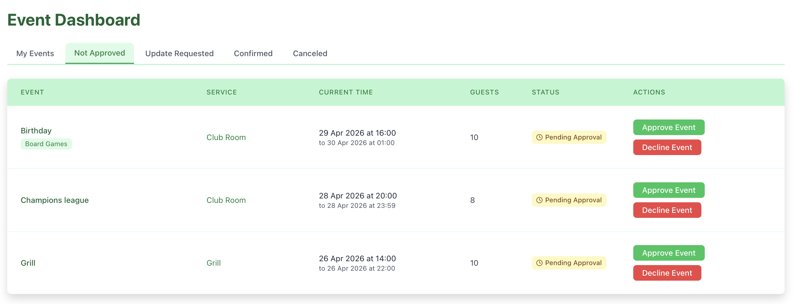
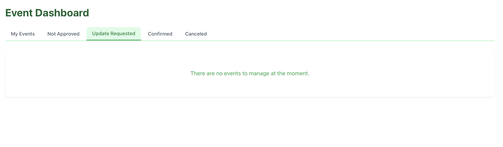
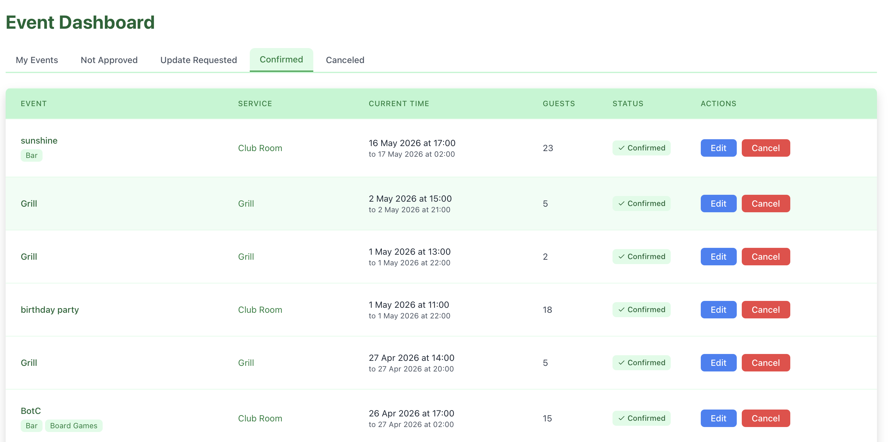
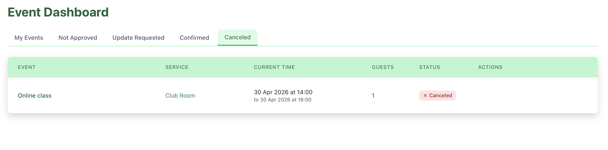

# Dashboard

The **Dashboard** provides an overview of all your reservations.  
Here you can track their status, manage upcoming events, and review past activity.

---

## Dashboard Overview

At the top of the page, you’ll find navigation tabs that group your reservations by status:

- **My Events**
- **Not Approved**
- **Update Requested**
- **Confirmed**
- **Canceled**

Each tab helps you quickly filter and manage reservations.

---

## My Events

The **My Events** tab shows your personal reservations divided into two sections:

### Upcoming Events

Displays all **current and future reservations**.

Each event includes:

- **Event name**
- **Service** (e.g., Club Room)
- **Date and time range**
- **Number of guests**
- **Status** (e.g., Confirmed)

#### Available Actions

Depending on the reservation state, you can:

- **Request Time Change** – Propose a new time for your reservation
- **Cancel** – Cancel the reservation

---

### Past Events

Displays your **previous reservations**.

This section is read-only and helps you:

- Review past activity
- Track usage history

---

## Reservation Status Tabs

### Not Approved

Shows reservations that are **waiting for approval**.

- Status is marked as **Pending Approval**
- No access is granted until approval

---

### Update Requested

Displays reservations where a **time change has been requested**.

- Waiting for manager approval
- Original reservation remains active until confirmed

---

### Confirmed

Shows all **approved reservations**.

- These reservations are fully active
- Access rights (if applicable) are granted

---

### Canceled

Displays all **canceled reservations**.

- Includes both user-canceled and manager-rejected events

---

## Role Differences (Brief)

- **Regular Users**
  - View their reservations
  - Cancel reservations
  - Request time changes

- **Managers**
  - Can additionally:
    - **Approve events**
    - **Decline events**

Manager-specific actions are visible only in relevant tabs (e.g., *Not Approved*).

---

## What’s Next

From the Dashboard, you can:

- Manage your reservations
- Track their status
- Navigate back to services to create new reservations

For more details about creating or modifying reservations, see the related sections.