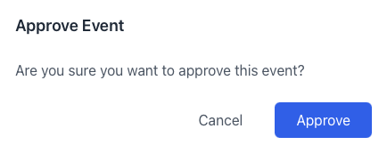
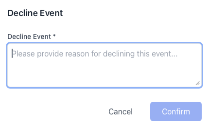
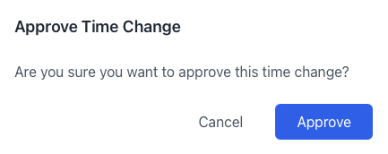
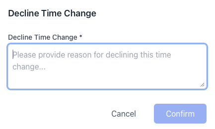
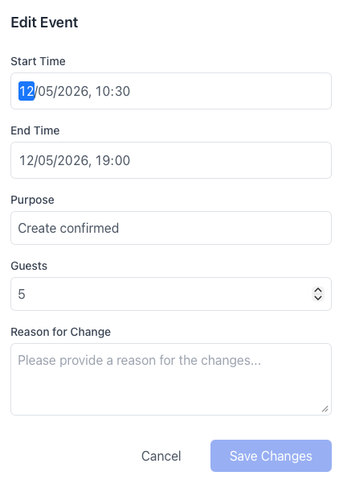
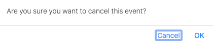

# Reviewing Reservations

As a manager, you are responsible for reviewing reservation requests that require approval. This process ensures that all bookings meet the necessary criteria and do not conflict with other events.

---

## Reviewing Pending Approvals

Reservations that cannot be confirmed automatically appear in the **Not Approved** tab of the [Dashboard](dashboard.md). This typically includes:

- **Night-time reservations**
- **Reservations exceeding capacity limits**
- **Specific services** or reservation types that require explicit manager permission

### Approving an Event

To approve a request:

1. Locate the reservation in the **Not Approved** tab.
2. Click the **Approve Event** icon in the actions column.
3. In the confirmation dialog, review the details and click **Approve**.

### Declining an Event

If a reservation cannot be fulfilled, you can decline it:

1. Click the **Decline Event** icon in the actions column.
2. In the dialog, you can provide a reason in the **Manager Observation** field.
3. Click **Confirm**.

---

## Reviewing Time Changes

When a user requests a new time for an existing reservation, it appears in the **Update Requested** tab.

### Approving a Time Change

Approving the request will update the reservation to the new proposed time.

1. Click the **Approve Time Change** icon.
2. Confirm the update in the dialog.

### Declining a Time Change

If the proposed time is not suitable, you can decline the change. The reservation will remain at its original time.

1. Click the **Decline Time Change** icon.
2. Confirm the rejection in the dialog.

---

## Editing and Canceling

Managers can also perform general maintenance on reservations from **Update Requested** tab where the actions are available.

### Editing Reservations

You can modify details like the number of people or add observations to any active reservation.

1. Click the **Edit Event** icon.
2. Update the fields and click **Save Changes**.

### Canceling Reservations

Managers can cancel a reservation at any time.

1. Click the **Cancel Event** icon.
2. Confirm the cancellation in the dialog.

---

## Manager Observations

The **Manager Observation** field is a powerful communication tool. When you perform an action (approve, decline, or edit), the system automatically sends an **email notification** to the user.

- **Email Content**: The email includes the updated status of the reservation and any text you entered in the **Manager Observation** field.
- **Usage**: Use this field to provide instructions (e.g., "Pick up keys at reception"), explain why a request was declined, or request further information.
