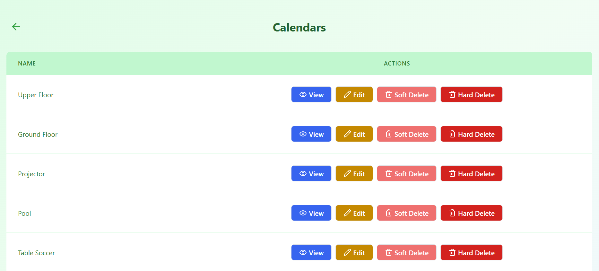
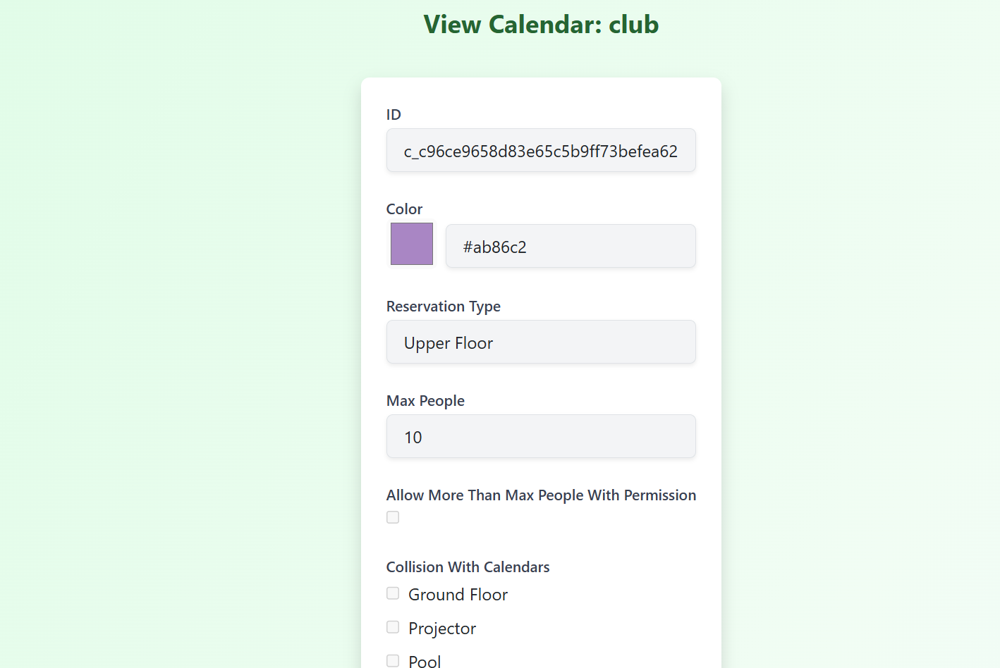
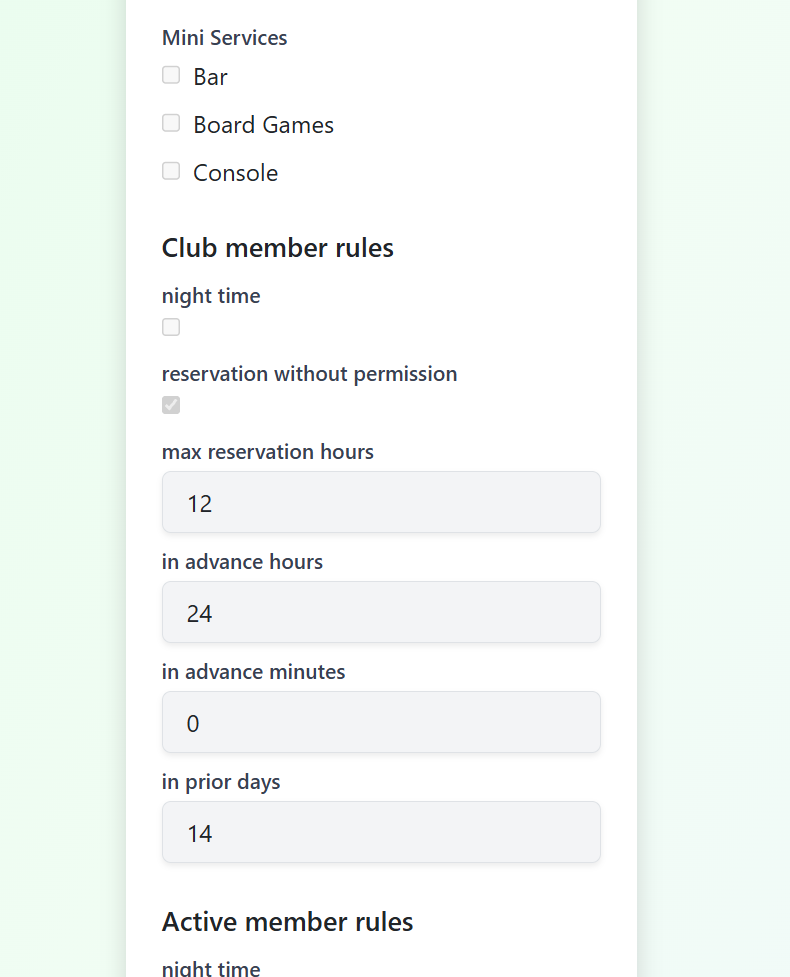

# Manage Calendars

Calendars define **when and how a service can be reserved**.  
Each calendar belongs to a specific reservation service and controls availability rules, limits, and reservation behavior.

From the **Manager Panel**, managers can view and manage calendars assigned to a service.

This section focuses on **calendars only**.  
Mini-services and advanced rules are described later.

---

## Calendars Overview

In the **Calendars** section, managers see a list of all calendars associated with the selected service.

Each calendar typically represents:

- A specific area or resource (e.g. Upper Floor, Pool, Projector)
- A reservation type within the same service
- Different rules or limits for the same service

---

## Available Actions

For each calendar, the following actions may be available depending on your role.

### View Calendar Details

Click **View** to open the calendar details page.

The details page displays:

- Calendar ID and color
- Reservation type name
- Maximum allowed people
- Collision rules with other calendars
- Assigned mini-services
- Reservation constraints and member rules

This page is primarily used to **inspect rules and configuration**.

---

### Edit Calendar

- **Editing calendars is currently restricted to manager of specific reservation service**
- Manager other reservation service can view all settings but cannot modify them

Editing may include:

- Changing calendar color
- Updating maximum number of people
- Allowing or restricting overlaps with other calendars
- Assigning mini-services
- Configuring reservation and member rules

---

### Soft Delete Calendar

Click **Soft Delete** to temporarily disable a calendar.

- The calendar becomes unavailable for new reservations
- Existing reservations and data are preserved
- The calendar can be restored later
- Restricted to manager of specific reservation service

Soft-deleted calendars are visually distinguished in the list.

---

### Hard Delete Calendar

Click **Hard Delete** to permanently remove a calendar.

- All related configuration is removed
- This action is **irreversible**
- Restricted to superusers

Use with caution, especially if the calendar has existing reservations.

---

### Restore Soft-Deleted Calendar

For soft-deleted calendars, a **Retrieve** option is available.

- Restores the calendar
- Makes it available for reservations again
- Restricted to manager of specific reservation service

---

## Role Differences (Brief)

- **Managers**
  - View, edit, soft delete calendars and their configuration, but under their specific reservation service
  - Understand availability and reservation rules

- **Superusers**
  - Full control, including editing, restoring, soft and hard deletion

The interface is shared, but available actions depend on permissions.

---

## What’s Next

Calendars are often used together with:

- **Mini-services** (optional add-ons like equipment or extras)
- **Reservation rules** (time limits, advance booking, permissions)

These topics are covered in the next sections.