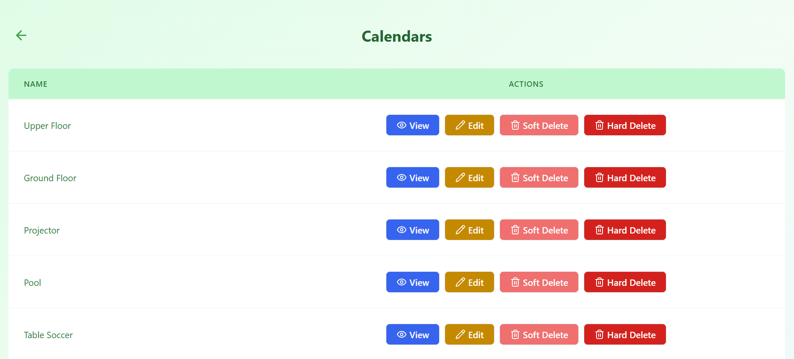
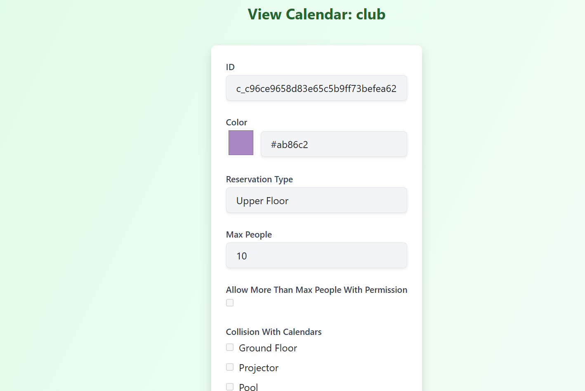
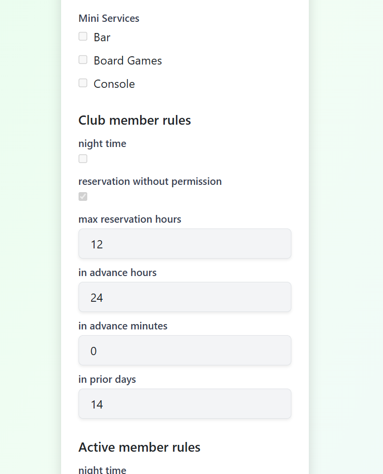

# Manage Calendars :fontawesome-solid-calendar-days:{ .main-color }

Calendars are the heartbeat of Reservium. They define exactly **when and how** a service can be reserved. Each calendar controls the specific availability rules, participant limits, and collision behavior for a given space.

---

## :fontawesome-solid-list-ul: Calendars Overview

The **Calendars** section provides a bird's-eye view of all booking tracks associated with your service.

A single service (like a "Club Room") might have multiple calendars for:

- :fontawesome-solid-layer-group: **Different Areas**: Upper floor vs. Ground floor.
- :fontawesome-solid-tags: **Reservation Types**: Entire space vs. Single desk.
- :fontawesome-solid-clock: **Specific Rules**: Different hours or limits for the same physical room.

---

## :fontawesome-solid-gears: Available Actions

Manage your calendars using the actions column in the list view.

### :fontawesome-solid-eye: View Details
Click **View** to inspect the internal logic of a calendar. This is where you verify if the rules are working as intended.

**What you can check:**

- :fontawesome-solid-palette: **Visuals**: The color used in the public calendar.
- :fontawesome-solid-people-arrows: **Collision Rules**: Whether this calendar blocks others.
- :fontawesome-solid-screwdriver-wrench: **Mini-services**: Which add-ons are available for this track.

---

### :fontawesome-solid-pen: Edit Configuration
While viewing permissions are broad, editing is restricted to ensure stability.

- **Permissions**: Only the designated manager of the specific service can modify its calendars.
- **Capabilities**: Update participant limits, change colors, or reconfigure rule sets.

---

### :fontawesome-solid-box-archive: Soft Delete
Use **Soft Delete** to temporarily take a calendar offline without losing any historical data.

- :fontawesome-solid-ban: **New Bookings**: Prevented immediately.
- :fontawesome-solid-database: **Existing Data**: Preserved for records.
- :fontawesome-solid-arrows-rotate: **Restoration**: Can be retrieved at any time.

---

### :fontawesome-solid-trash-can: Hard Delete
Permanently removes the calendar and all associated configuration.

!!! danger "Irreversible Action"
    Hard deletion is restricted to **Superusers** and should only be used for cleaning up incorrectly created entries. This action cannot be undone.

---

## :fontawesome-solid-user-shield: Permissions Summary

| Action | Manager | Superuser |
| :--- | :---: | :---: |
| View Rules | :fontawesome-solid-check: | :fontawesome-solid-check: |
| Edit Rules | :fontawesome-solid-check: | :fontawesome-solid-check: |
| Soft Delete | :fontawesome-solid-check: | :fontawesome-solid-check: |
| Hard Delete | :fontawesome-solid-xmark: | :fontawesome-solid-check: |
| Restore | :fontawesome-solid-check: | :fontawesome-solid-check: |

---

## :fontawesome-solid-arrow-right-long: What’s Next?

Calendars work hand-in-hand with other configurations:

- **[Manage Mini-Services](manage-mini-services.md)**: Add equipment or extras to your tracks.
- **[Manage Services](manage-reservation-services.md)**: Configure high-level room metadata.
