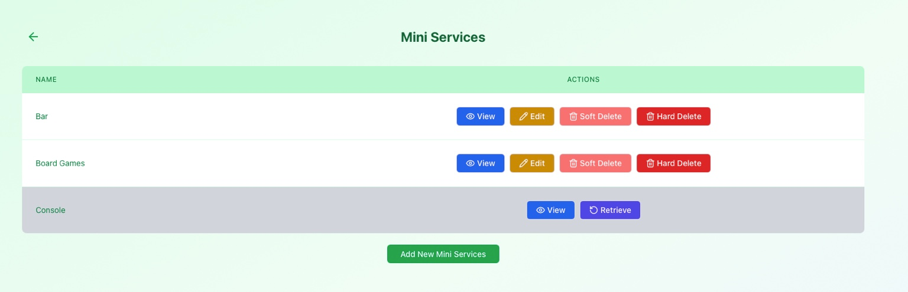
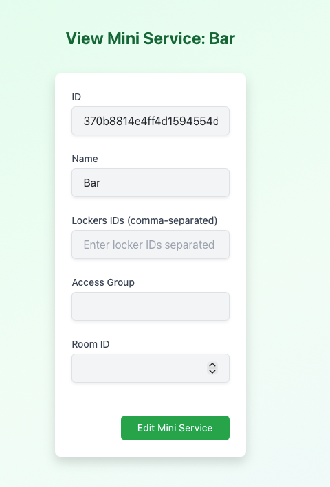

# Manage Mini Services

Mini services define **optional add-ons** that can be attached to a reservation — for example equipment, amenities, or extra options such as a bar, board games, or a console.

Mini services always belong to a **specific reservation service** and can be assigned to one or more calendars.

This section focuses on **mini services only**.  
Calendar configuration and reservation rules are described elsewhere.

---

## Mini Services Overview

In the **Mini Services** section, managers see a list of all mini services available for the selected reservation service.

Each mini service represents an optional item or feature that users can select when creating a reservation, such as:

- Bar access
- Board games
- Console
- Other equipment or extras

---

## Available Actions

For each mini service, the following actions may be available depending on your role.

### View Mini Service Details

Click **View** to open the mini service details page.

The details page displays:

- Mini service ID and name
- Associated access group (if any)
- Related room or locker configuration

This page is mainly used to **inspect configuration** and verify settings.

---

### Edit Mini Service

Click **Edit** to modify a mini service.

Editing may include:

- Updating the mini service name
- Changing access group restrictions
- Assigning room or locker identifiers
- Adjusting internal metadata

Only users with sufficient permissions for the reservation service can edit mini services.

---

### Soft Delete Mini Service

Click **Soft Delete** to temporarily disable a mini service.

- The mini service becomes unavailable for new reservations
- Existing reservation data is preserved
- The mini service can be restored later
- Restricted to managers of the reservation service

Soft-deleted mini services are visually distinguished in the list.

---

### Hard Delete Mini Service

Click **Hard Delete** to permanently remove a mini service.

- All related configuration is removed
- This action is **irreversible**
- Restricted to superusers

Use this option with caution.

---

### Restore Soft-Deleted Mini Service

For soft-deleted mini services, a **Retrieve** option is available.

- Restores the mini service
- Makes it selectable for reservations again
- Restricted to managers of the reservation service

---

## Role Differences (Brief)

**Managers:**

- View, create, edit, soft delete, and restore mini services
- Manage availability of optional reservation add-ons

**Superusers:**

- Full control, including hard deletion

The interface is shared, but available actions depend on permissions.

---

## What’s Next

Mini services are typically used together with:

- **Calendars**, where they are assigned and made available
- **Reservation rules**, which may restrict usage based on time or permissions

These topics are covered in the following sections.