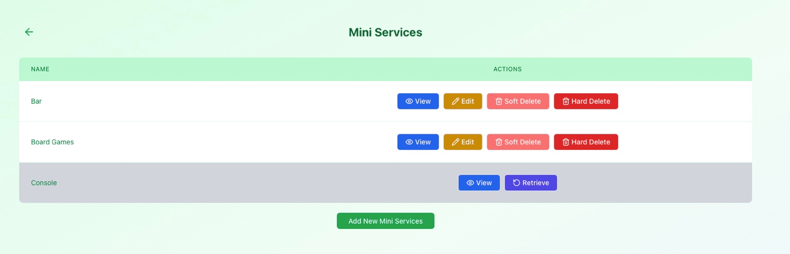
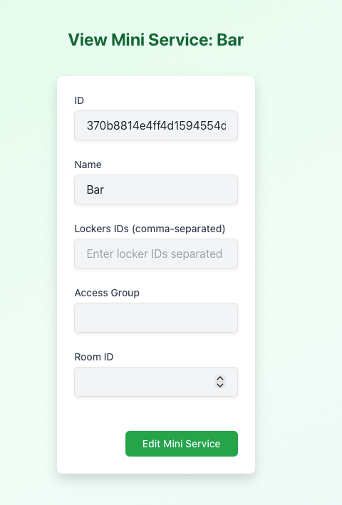

# Manage Mini-Services :fontawesome-solid-boxes-stacked:{ .main-color }

Mini-services allow you to offer **optional extras** alongside a reservation. Whether it's a projector for a meeting room or bar access for a social event, these add-ons enhance the user experience and help you track resource usage.

---

## :fontawesome-solid-puzzle-piece: Mini-Services Overview

Each mini-service belongs to a specific parent service but can be selectively assigned to one or more calendars within that service.

Common examples of mini-services:

- :fontawesome-solid-martini-glass: **Bar or Catering** access.
- :fontawesome-solid-gamepad: **Gaming Consoles** or equipment.
- :fontawesome-solid-dice: **Board Games** collection.
- :fontawesome-solid-key: **Special Access** permissions.

---

## :fontawesome-solid-gears: Available Actions

### :fontawesome-solid-eye: View Details
Inspect the technical configuration of an add-on, including its access groups and metadata.

**Key info shown:**

- :fontawesome-solid-id-card: **Service ID**: Internal identifier.
- :fontawesome-solid-shield-halved: **Access Groups**: Roles required to see/book this service.
- :fontawesome-solid-door-closed: **Room Metadata**: Internal room or locker assignments.

---

### :fontawesome-solid-pen: Edit Service
Modify the name, access requirements, or internal tracking data.

- **Note**: Only users with manager permissions for the parent service can perform edits.

---

### :fontawesome-solid-box-archive: Soft Delete
Disable an add-on without losing its historical association with past reservations.

- :fontawesome-solid-ban: The service disappears from the user's booking form immediately.
- :fontawesome-solid-arrows-rotate: Can be **Retrieved** (Restored) if needed later.

---

### :fontawesome-solid-trash-can: Hard Delete
Permanently removes the service from the database.

!!! danger "Use with Caution"
    Hard deletion is an irreversible action restricted to **Superusers**. It is recommended to use Soft Delete for general maintenance.

---

## :fontawesome-solid-user-shield: Permissions Summary

| Action | Manager | Superuser |
| :--- | :---: | :---: |
| View/Edit | :fontawesome-solid-check: | :fontawesome-solid-check: |
| Soft Delete | :fontawesome-solid-check: | :fontawesome-solid-check: |
| Hard Delete | :fontawesome-solid-xmark: | :fontawesome-solid-check: |
| Restore | :fontawesome-solid-check: | :fontawesome-solid-check: |

---

## :fontawesome-solid-arrow-right-long: What’s Next?

Mini-services aren't useful until they are assigned:

- **[Manage Calendars](manage-calendars.md)**: Learn how to attach these add-ons to specific reservation tracks.
- **[Manage Services](manage-reservation-services.md)**: Oversee the high-level service structure.
