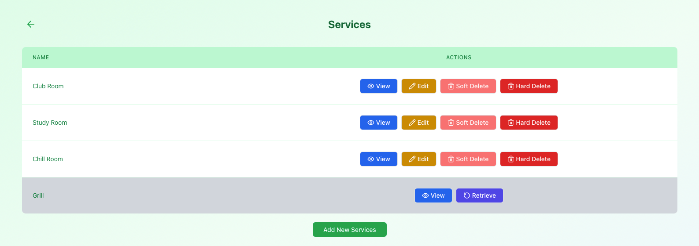
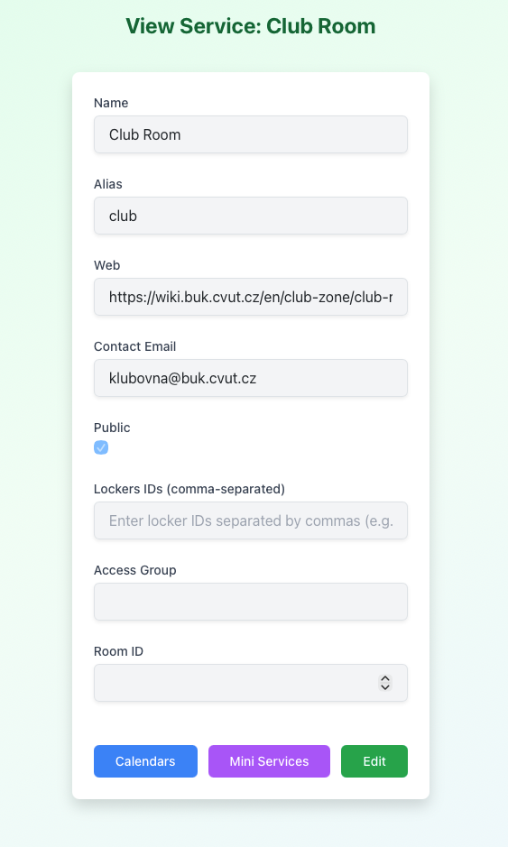

# Manage Reservation Services

Reservation services define **what can be reserved** in Reservium — for example, rooms, spaces, or facilities.  
From the **Manager Panel**, managers can view and manage the list of available services.

This section explains how to work with **services only**.  
Calendars and mini-services are described in separate sections.

---

## Services Overview

In the **Services** section, managers see a list of all reservation services available in the system.

Each service represents a reservable entity, such as:

- Club Room
- Study Room
- Chill Room
- Other shared or private spaces

---

## Available Actions

For each service, the following actions may be available depending on your role.

### View Service Details

Click **View** to open the service details page.

The details page displays:

- Service name and alias
- Public visibility status
- Contact information
- External website (if provided)
- Access and room-related metadata

From this page, managers can also navigate to:
- **Calendars** associated with the service
- **Mini-services** available for the service

!!! note

    These sections are covered later in the documentation.

---

### Edit Service

- **Editing services is currently restricted to superusers**
- Managers can view service details but cannot modify them

Editing includes updating service metadata such as:
- Name and alias
- Visibility (public/private)
- Contact and web information
- Access-related settings
- Room and locker configuration

---

### Soft Delete Service

Click **Soft Delete** to temporarily disable a service.

- The service becomes unavailable for new reservations
- Existing data is preserved
- The service can be restored later
- Restricted to superusers

Soft-deleted services are visually distinguished in the list.

---

### Hard Delete Service

Click **Hard Delete** to permanently remove a service.

- All related data is removed
- This action is **irreversible**
- Restricted to superusers

Use this option with caution.

---

### Restore Soft-Deleted Service

For soft-deleted services, a **Retrieve** option is available.

- Restores the service
- Makes it available for reservations again
- Restricted to superusers

---

## Role Differences (Brief)

- **Managers**
  - View services
  - Access calendars and mini-services

- **Superusers**
  - Full control, including editing, restoring, soft and hard deletion

Manager and superuser interfaces look similar, but available actions may differ.

---

## What’s Next

After selecting a service, managers typically continue with:

- Managing **calendars** (availability, time rules)
- Managing **mini-services** (optional add-ons for reservations)

These topics are covered in the following sections.