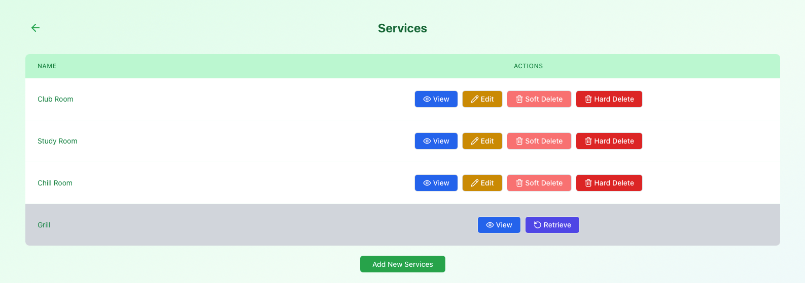
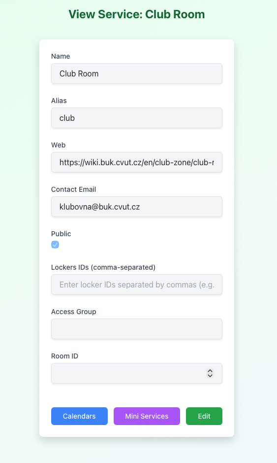

# Manage Reservation Services :fontawesome-solid-building-circle-check:{ .main-color }

Reservation Services are the top-level entities in Reservium. They represent the actual rooms, spaces, or facilities that your organization makes available for booking.

---

## :fontawesome-solid-building-columns: Services Overview

The **Services** list provides an inventory of all reservable spaces. Each service acts as a container for calendars and mini-services.

Examples of services include:

- :fontawesome-solid-door-open: **Meeting Rooms**
- :fontawesome-solid-graduation-cap: **Study Zones**
- :fontawesome-solid-couch: **Chill Rooms**

---

## :fontawesome-solid-gears: Available Actions

### :fontawesome-solid-eye: View Details
See high-level metadata and configuration for a specific space.

**Key Information:**

- :fontawesome-solid-signature: **Name & Alias**: How the service appears to users.
- :fontawesome-solid-globe: **Visibility**: Whether the room is public or hidden.
- :fontawesome-solid-envelope: **Contact Email**: The email address for service-related inquiries.
- :fontawesome-solid-address-card: **Contact Info**: Links or websites for the room.
- :fontawesome-solid-microchip: **Metadata**: Internal room and locker IDs.

---

### :fontawesome-solid-pen: Edit Metadata
Updating the core identity of a service (like its name or visibility) is a sensitive operation.

- **Permission**: Currently restricted to **Superusers**.
- **Scope**: Managers can view these details but cannot modify the top-level service metadata.

---

### :fontawesome-solid-box-archive: Soft Delete
Temporarily hide a service from all users.

- :fontawesome-solid-ban: No new calendars or reservations can be created while deleted.
- :fontawesome-solid-database: All existing data remains safe in the background.

---

### :fontawesome-solid-trash-can: Hard Delete
Permanently erases the service and all its children (calendars, mini-services, events).

!!! danger "Critical Action"
    Hard deletion is restricted to **Superusers** and is **irreversible**. Use only for removing test data or redundant entries.

---

## :fontawesome-solid-user-shield: Permissions Summary

| Action | Manager | Superuser |
| :--- | :---: | :---: |
| View Details | :fontawesome-solid-check: | :fontawesome-solid-check: |
| Edit Service | :fontawesome-solid-xmark: | :fontawesome-solid-check: |
| Soft Delete | :fontawesome-solid-xmark: | :fontawesome-solid-check: |
| Hard Delete | :fontawesome-solid-xmark: | :fontawesome-solid-check: |
| Access Calendars | :fontawesome-solid-check: | :fontawesome-solid-check: |

---

## :fontawesome-solid-arrow-right-long: What’s Next?

Once a service is defined, you can build its internal logic:

- **[Manage Calendars](manage-calendars.md)**: Set up the actual booking tracks and rules.
- **[Manage Mini-Services](manage-mini-services.md)**: Add optional extras for the service.
