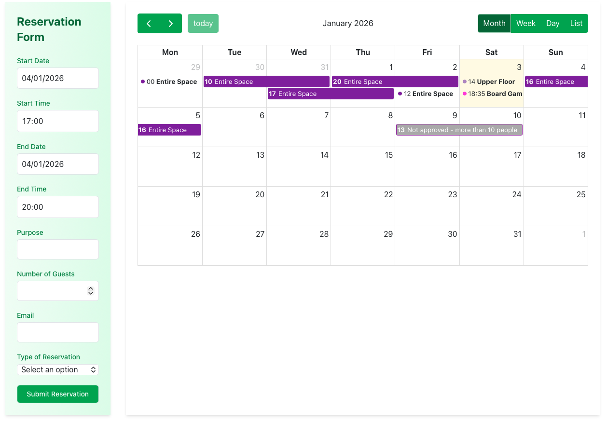
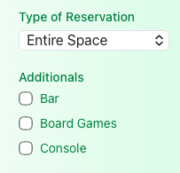

# Create Reservation

This page explains how to create a reservation in Reservium, how reservation
types affect the process, and what happens if additional validation or approval
is required.

---

## Reservation Form Overview

The **reservation form** is located on the **left side** of the page.

You must provide the following information:

- **Start date & time** – When the reservation begins
- **End date & time** – When the reservation ends
- **Purpose** – Reason for the reservation
- **Number of guests** – Total number of participants
- **Email** – Contact email for notifications
- **Reservation type** – Type of space or area being reserved
- **Additional services** – Optional extras (if available)

---

## Reservation Types and Rules

Each service can have **multiple reservation types**, such as:

- Entire Space  
- Upper Floor  
- Specific Area  
- atd

Reservation rules **depend on the selected type**, and may differ by:

- Maximum number of participants
- Allowed time range
- Advance booking limits
- Approval requirements
- Available additional services

!!! Info

    Changing the reservation type may affect what rules apply.

---

## Optional Mini-Services

Some reservation types allow selecting **additional mini-services**, for example:

- Board games
- Consoles or equipment
- Extra access permissions

Available mini-services depend on:

- The selected service
- The reservation type

!!! Info

    If no additional services are available, this section may be hidden.

---

## Validation and Error Messages

When you submit the reservation, Reservium performs automatic validation checks,
including:

- Time slot availability
- Participant limits
- Required permissions or membership
- Restricted time periods (e.g. night reservations)

### Validation Errors

If something is incorrect or not allowed:

- The reservation is **not created**
- A **warning or error message** explains what went wrong
- You can adjust the form and try again

Examples:
- Time slot already reserved
- Too many participants
- Reservation outside allowed hours
- Missing required data

---

## Reservations Requiring Approval

Some reservations cannot be confirmed automatically, for example:

- Night-time reservations
- Reservations exceeding capacity limits

- Reservations requiring manager permission

In these cases:

- The reservation is created with **Not approved** status
- Managers are notified for approval
- You will receive updates by email

---

## Successful Reservation

If all checks pass and no approval is required:

- The reservation is created immediately
- It appears in the calendar
- A confirmation message is shown

You will also receive a **confirmation email** with:

- Reservation details
- Date and time
- Selected service and type
- Additional services (if any)

---

## After Creating a Reservation

Once created, you can:

- View your reservations in **My Events**
- Track current, upcoming, and past reservations
- See approval status if applicable

Managing existing reservations (edit, cancel, approval flow) is described in a
separate section of the documentation.