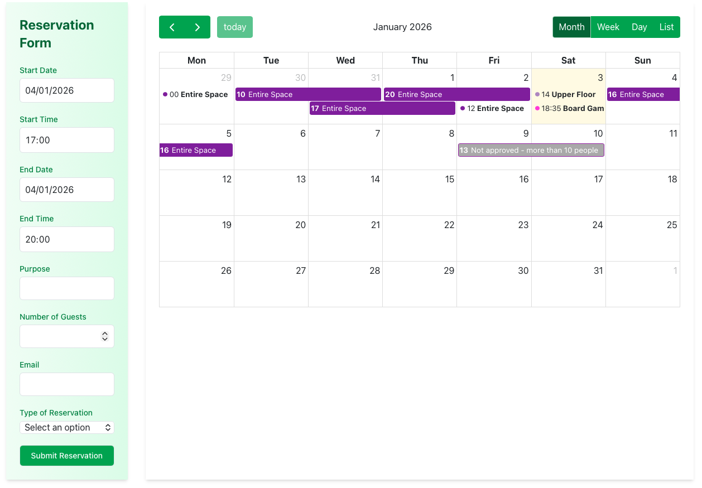
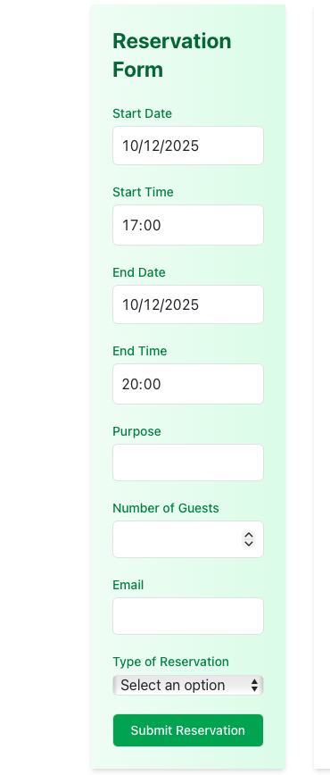
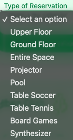
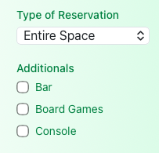
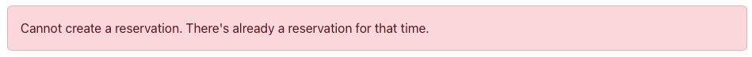
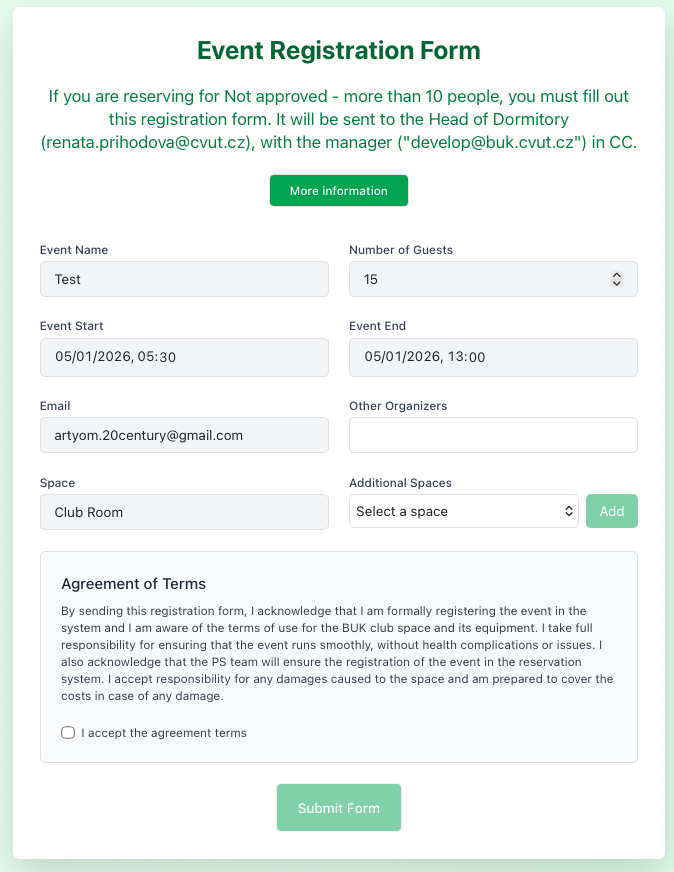
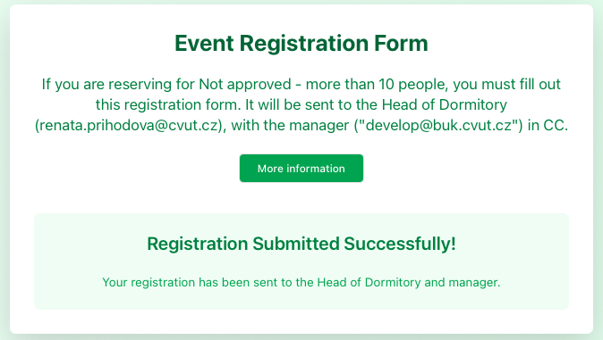
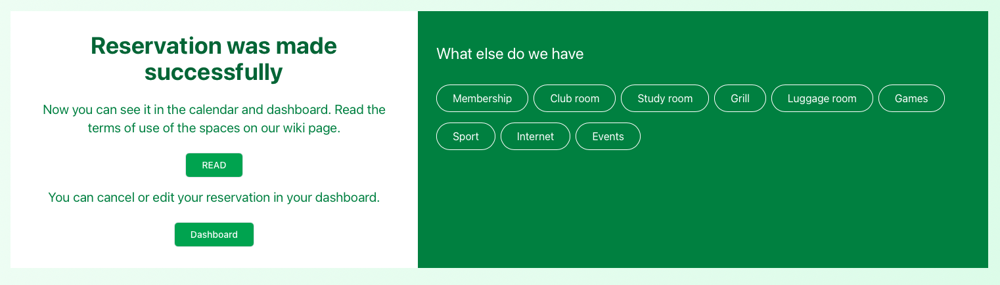
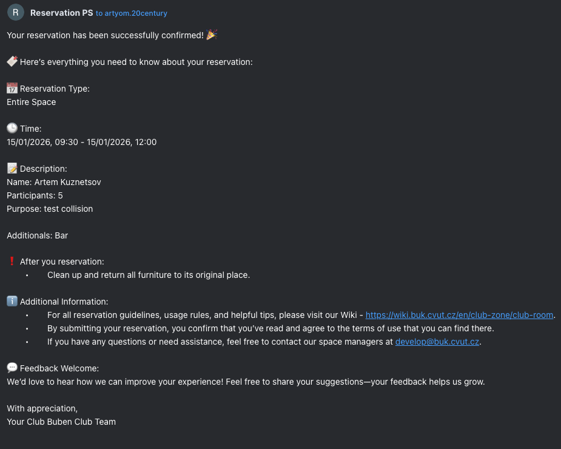

# Create Reservation :material-plus-circle-outline:{ .main-color }

Creating a reservation in Reservium is a straightforward process. This guide will walk you through the reservation form, the impact of reservation types, and how to handle validations and approvals.

---

## :material-form-select: Reservation Form Overview

The **reservation form** is conveniently located on the **left side** of the page, allowing you to quickly enter your details while keeping the calendar in view.

### Required Information

To ensure a smooth booking, you must provide the following:

- **Start & End Time** – Specify the exact duration of your reservation.
- **Purpose** – Briefly describe why you are reserving the space.
- **Guests** – The total number of participants.
- **Email** – Your contact address for confirmation and updates.
- **Type** – Select the specific area or floor you wish to book.
- **Additional Services** – Select any extras like equipment or catering (if available).

---

## :material-tune-variant: Reservation Types and Rules

Services can offer different **reservation types**, which allow for flexible booking of the same space. Common types include:

- :material-layers-outline: **Entire Space**
- :material-stairs-up: **Upper Floor**
- :material-vector-square: **Specific Area**

!!! warning "Rules vary by type"
    Each reservation type may have unique constraints:

    - **Participant Limits**: Minimum/maximum people allowed.
    - **Time Windows**: Specific hours when the type is available.
    - **Lead Time**: How far in advance you must book.
    - **Approval**: Whether a manager needs to manually confirm the booking.

---

## :material-puzzle-outline: Optional Mini-Services

Enhance your reservation by selecting **additional mini-services**. These are tailored to the service and reservation type you've chosen.

Examples of mini-services include:

- :material-controller: **Gaming Consoles** or VR equipment.
- :material-dice-5: **Board Games** collection access.
- :material-key-variant: **Extra Access Permissions** for restricted areas.

!!! info
    This section only appears if the selected reservation type supports additional services.

---

## :material-shield-check-outline: Validation and Error Messages

Upon submission, Reservium automatically validates your request against real-time availability and service rules.

### :material-alert-circle-outline: Common Validation Errors

If a conflict is detected, you will see a warning message explaining the issue. You can then adjust your request and try again.

| Error Type | Description |
| :--- | :--- |
| **Availability** | The requested time slot is already fully or partially booked. |
| **Capacity** | The number of guests exceeds the limit for the selected type. |
| **Timing** | The reservation falls outside of allowed operating hours. |
| **Permissions** | You do not have the required role or membership level. |

---

## :material-account-clock-outline: Reservations Requiring Approval

In some scenarios, your reservation might not be confirmed immediately. This usually happens for high-demand periods or large-scale events.

### The Approval Flow:
1. **Submit**: Create your reservation as usual.
2. **Pending**: The status will show as **"Not approved"**.
3. **Review**: A manager receives a notification to review your request.
4. **Update**: You will receive an email once the manager approves or declines the request.

---

## :material-check-decagram: Successful Reservation

Once all checks pass (and approval is granted if necessary), your reservation is finalized.

### Confirmation Email
You will receive a detailed email containing:

- :material-calendar-check: **Date and Time**
- :material-map-marker: **Service and Type**
- :material-star-outline: **Selected Add-ons**
- :material-link-variant: **Management Links**

---

## :material-arrow-right-circle-outline: What's Next?

After your reservation is confirmed, you can:

- View it in your **[Dashboard](dashboard.md)**.
- Track status updates in **My Events**.
- Prepare for your visit!
