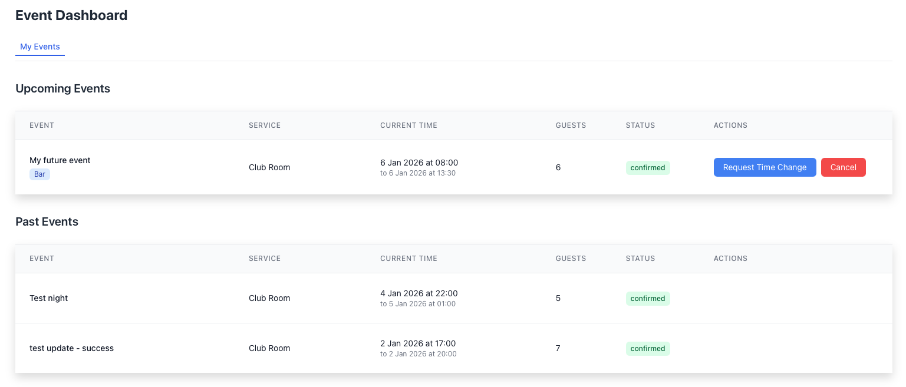

# Dashboard

The **Dashboard** is where you manage and track all your reservations.  
It gives you a clear overview of your upcoming and past events, along with their current status.

---

## Accessing the Dashboard

You can open the Dashboard from the **user menu** in the top-right corner:

1. Click your **username**
2. Select **My Events**

---

## Dashboard Overview

The Dashboard is divided into two main sections:

### Upcoming Events

This section displays all **current and future reservations**.

If you don’t have any upcoming reservations, you’ll see an informational message indicating that no events are scheduled.

---

### Past Events

Below the upcoming events, you’ll find a list of **past reservations**.

Each entry shows key details such as:

- **Event name**
- **Service** (e.g., Club Room, Chill Room)
- **Date and time**
- **Number of guests**
- **Reservation status**

---

## Reservation Statuses

Each reservation is marked with a clear status label, for example:

- **confirmed** – The reservation is approved and active
- **not_approved** – Waiting for manual approval
- **canceled** – The reservation was canceled

These statuses help you quickly understand the current state of each reservation.

---

## Available Actions (Regular Users)

For each reservation, regular users can:

- **View reservation details**
- **Delete a reservation**
- **Request a change** (e.g., update the reservation time)
- **Check the approval status**

All actions are available directly from the reservation list.

!!! Note "Manager View (Brief Note)" 

    Managers see the same Dashboard layout as regular users.  
    However, they have **additional management options** (such as approval and administration tools).

    Detailed manager functionality is covered separately in the **Manager Guide**.
