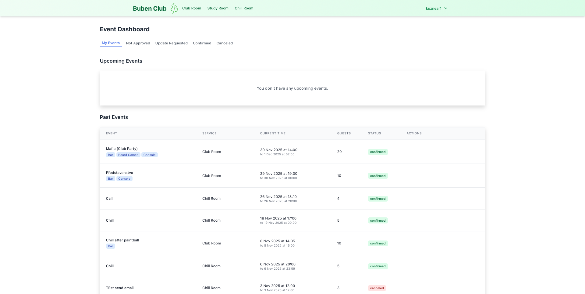
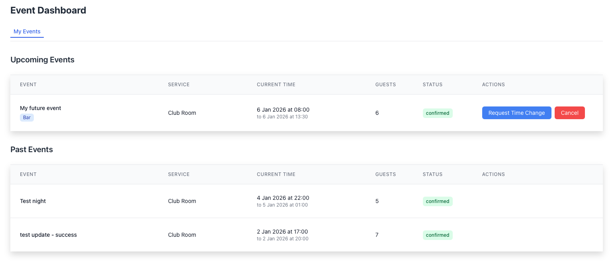

# Dashboard :material-view-dashboard-outline:{ .main-color }

The **Dashboard** is your personal command center in Reservium. It's where you can track all your active bookings, review past events, and manage your schedule at a glance.

---

## :material-login: Accessing the Dashboard

You can quickly reach your Dashboard from any page:

1. Click your **username** in the top-right corner.
2. Select **My Events** from the dropdown menu.

---

## :material-eye-outline: Dashboard Overview

The Dashboard is organized into two primary sections to help you focus on what's coming up next.

### :material-calendar-clock: Upcoming Events

This section displays all your **current and future reservations**.

- **Stay Informed**: Each card shows the service name, date, and time.
- **Empty State**: If you have no upcoming plans, a friendly message will let you know there are no scheduled events.

---

### :material-history: Past Events

Scroll down to see a complete history of your **past reservations**. This is useful for reviewing where you've been or re-booking a favorite spot.

Each entry includes:

- :material-tag-outline: **Event Name**
- :material-map-marker-outline: **Service** (e.g., Club Room, Chill Room)
- :material-calendar-range: **Date and Time**
- :material-account-group-outline: **Guests**
- :material-list-status: **Status**

---

## :material-label-multiple-outline: Understanding Statuses

Every reservation is assigned a status to keep you updated on its progress:

| Status | Description |
| :--- | :--- |
| :material-check-circle:{ .main-color } **confirmed** | Your reservation is approved and ready for you. |
| :material-clock-outline: **not_approved** | The reservation is pending review by a manager. |
| :material-cancel: **canceled** | The reservation has been removed. |

---

## :material-gesture-tap: Available Actions

Manage your reservations directly from the list:

- :material-magnify: **View Details** – See full information about the booking.
- :material-delete-outline: **Delete** – Cancel a reservation you no longer need.
- :material-calendar-edit: **Request Change** – Ask to update the time or details.
- :material-progress-check: **Check Status** – See if your pending reservation has been reviewed.

!!! info "Manager Privileges"
    If you have a manager role, you will see the same layout but with **additional administrative tools** to approve and edit reservations for other users. Learn more in the [Manager Guide](../../manager-guide/introduction/index.md).
