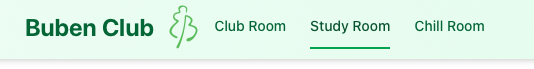
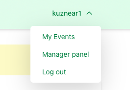
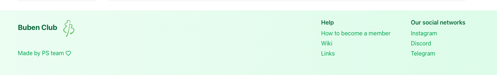

# Navigation

## Navigating Reservium on Desktop Browser

### Top Navigation Bar

At the top of the page, you’ll see the **navigation bar** with all the services you can reserve.

---

### Calendar View

- **Select a service:** Clicking on a service opens its calendar view, showing:

    - Reserved slots
    - Available slots
    - Reservation types (e.g., Entire Space, Ground Floor, Pool, etc.)
  
- **Calendar Views:** You can switch between different calendar views:
    - Day
  	- Week
  	- Month
  	- List

- **Reservation Details:** Hover over or click on any reservation to see detailed information about it.

---

### Reservation Form

On the **left side panel**, you’ll find the **reservation form**.

---

### User Menu

On the **top-right corner**, click your username to open a dropdown menu:

- **My Events:** View your reservations:
- **Logout:** Exit your account safely

### Dashboard

In my **My Events** you can find:

- **Current and Upcoming Reservations:** At the top
- **Past Reservations:** Below

---

### Footer

The footer contains useful links for quick access to

