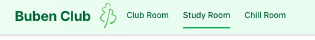
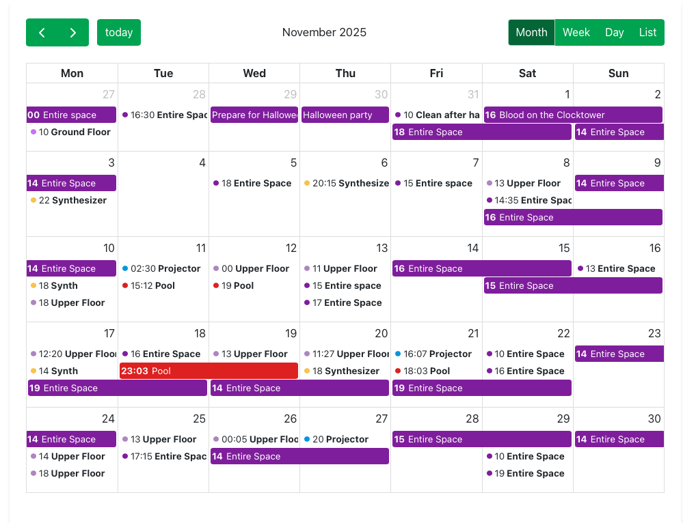
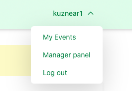
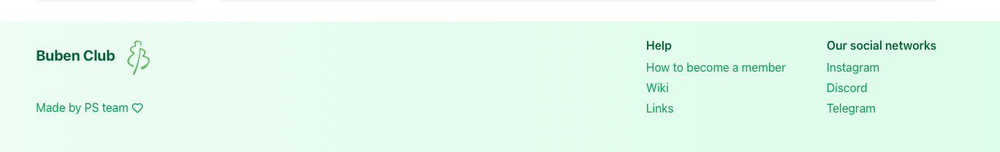

# Navigation :material-compass-outline:{ .main-color }

Navigating Reservium is designed to be intuitive and fast. This guide breaks down the main interface components you'll interact with on a desktop browser.

---

## :material-dock-top: Top Navigation Bar

The header is your gateway to all available services. Use it to quickly switch between different areas or rooms.

---

## :material-calendar-month: Calendar View

Once you select a service, the calendar becomes the central part of your experience.

- **:material-cursor-default-click: Select a Service:** Clicking a service name loads its specific calendar, displaying:
    - **Reserved slots**: Times that are already taken.
    - **Available slots**: Times you can book.
    - **Types**: Visual indicators for different areas (e.g., Entire Space vs. Pool).

- **:material-calendar-sync: Toggle Views:** Customize how you see availability:
    - :material-calendar-today: **Day**
  	- :material-calendar-week: **Week**
  	- :material-calendar-month: **Month**
  	- :material-view-list: **List**

- **:material-information-outline: Inspect Details:** Hover over or click any existing reservation to see its details.

---

## :material-form-select: Reservation Form

Located on the **left side panel**, this form is your primary tool for creating bookings. It stays pinned so you can reference the calendar while filling it out.

---

## :material-account-circle-outline: User Menu

In the **top-right corner**, click your name to manage your account:

- :material-calendar-heart: **My Events**: Access your dashboard and reservation history.
- :material-logout: **Logout**: Securely exit your session.

---

## :material-view-dashboard: Dashboard Quick View

Inside **My Events**, you'll find a summary of your activity:

- **Current & Upcoming**: Track what's happening now or soon.
- **Past Reservations**: A historical record of your bookings.

---

## :material-dock-bottom: Footer

The footer provides quick links to essential resources and support information at the bottom of every page.

