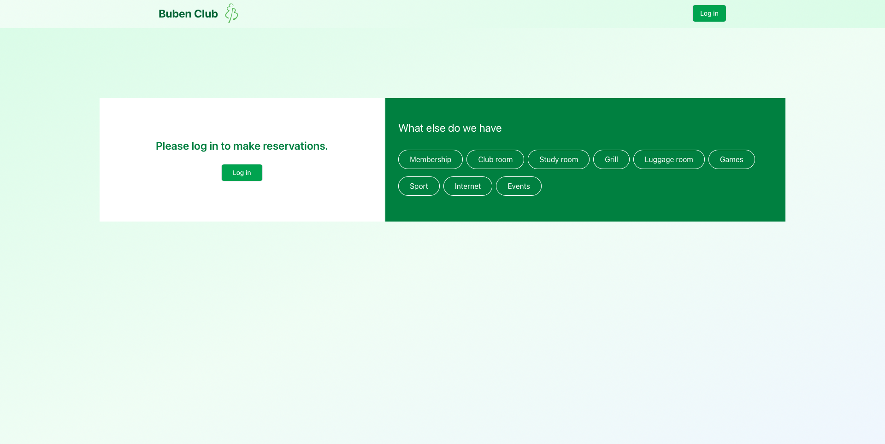

# First Setup

## Logging in to Reservium

To begin using Reservium, click **Log in**.

---

## Authenticate with Keycloak (SSO)

You will be redirected to the authentication page.
Reservium uses SSO (Single Sign-On) through Keycloak.

---

!!! warning "Authentication flow may differ" 

    Your organization may use different identity providers behind Keycloak —  
    such as LDAP, OAuth2, Google, Azure AD, or internal accounts.  
    The exact login method depends on how SSO is configured by your IT department.
    
After successful authentication, you’ll be redirected to the **Reservium Main Page**, where you can see your services and calendar overview.

---

## Creating Your First Reservation

To create a reservation, follow these steps:

1. Select a service

    Use the top navigation bar to choose the service you want to reserve
    (e.g., meeting room, workspace, conference room).

2. Fill out the reservation form

    Use the left-side panel to provide the required information:

    - Start date & time – When your reservation begins
    - End date & time – When your reservation ends
    - Purpose – The reason for your reservation
    - Participants – Number of people attending
    - Email – Contact email for the reservation
    - Reservation type – The specific room or room section
    - Additionals – Optional add-ons (equipment, accessories, services)
    
3. Submit the Reservation

    Click **Submit** to finalize the booking.

---

## Reservation Confirmation Email

After successfully creating a reservation, the system automatically sends you a confirmation email.
This email includes your reservation details such as date, time, location, and additional options selected.

## Reviewing Your Reservations

After creating a reservation, you can view it at any time:

1. Navigate to **Dashboard**
2. Overview your reservations

