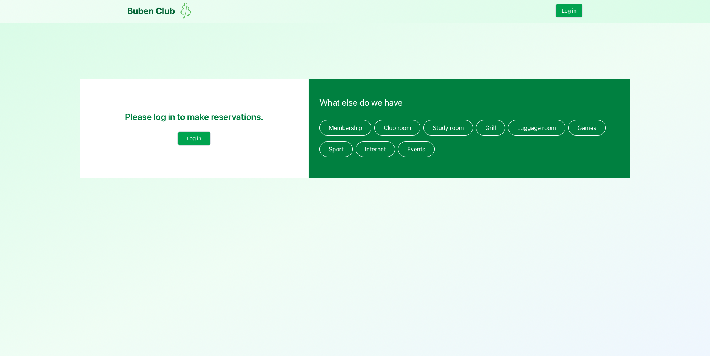
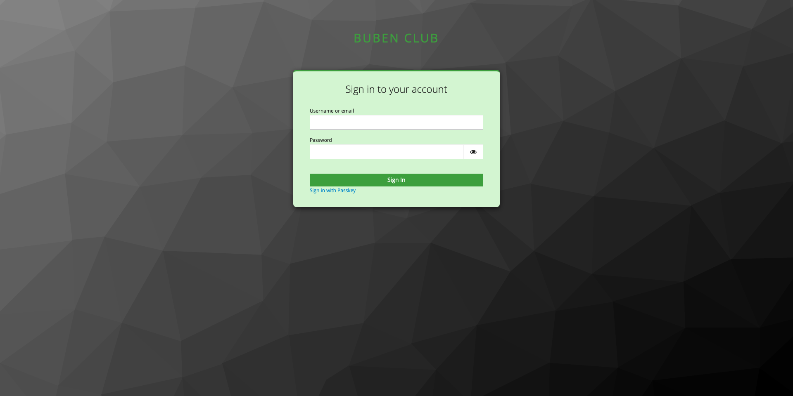
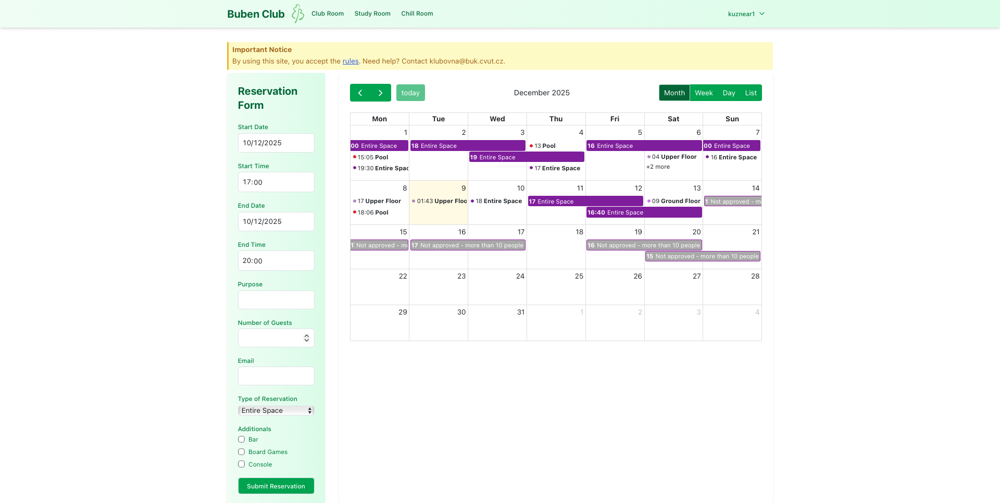

# First Setup :material-stairs-up:{ .main-color }

Welcome to Reservium! This guide will help you through your first login and show you how to create your very first reservation in just a few minutes.

---

## :material-numeric-1-circle-outline: Logging in

To begin, visit the Reservium home page and click the **Log in** button in the top navigation bar.

---

## :material-numeric-2-circle-outline: Authentication

You will be redirected to the **Keycloak SSO** (Single Sign-On) page. This ensures a secure and seamless login using your organization's credentials.

!!! warning "Identity Providers"
    The login screen might look slightly different depending on your organization's setup (e.g., LDAP, Google, Azure AD). If you're unsure which method to use, contact your IT department.

---

## :material-numeric-3-circle-outline: Create Your First Reservation

Once logged in, you'll see the main dashboard and available services.

### Follow these steps to book:

1.  **Choose a Service**: Use the top bar to select what you want to reserve (e.g., *Meeting Room*).
2.  **Fill the Form**: Use the left panel to enter your details:
    - :material-clock-start: **Start & End Time**
    - :material-message-text-outline: **Purpose**
    - :material-account-multiple: **Participants**
3.  **Submit**: Click the **Submit** button to finalize.

---

## :material-email-check-outline: Confirmation

After successful creation:
- **Immediate Feedback**: A success message appears in the app.
- **Email Receipt**: You'll receive an automated confirmation email with all the reservation details for your records.

---

## :material-numeric-4-circle-outline: Review Your Bookings

You can track your new reservation at any time via the Dashboard.

1. Navigate to **My Events** in the user menu.
2. Review the status and details of your booking.

